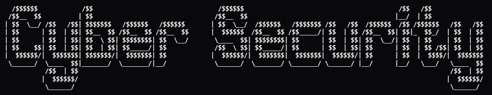

# Cybersecurity Chatbot App
This application is a C# console application that integrates speech features to deliver an interacive user experience with a chatbot that can answer questions about cyber security

## How to run app
* Clone the repo in Visual Studio
* Download the greeting.wav file available in this Repo
* Ensure that you change the file path of the greeting.wav file in the Chatbot.cs file in the program
* Run the application

## Features
* Speech greeting
* Interactive chatbot
* Type queries to chatbot
* Elegent error handling

## ASCII Image art

## Successful GitHub Actions Build

## Upcoming feautures
* Windows Presentation Framework (WPF) User interface
* Advanced query handling
* Interactive user experience

## Issues and contributions
Feel free to make contributions to the project if you come across any issue.

## Thank you
